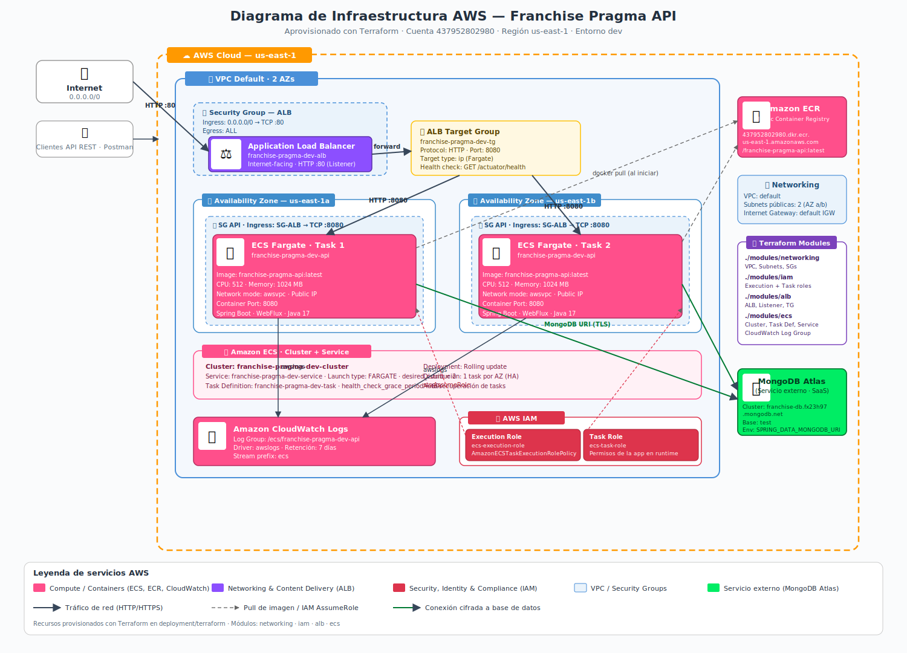

# Proyecto Base Implementando Clean Architecture

## Antes de Iniciar

Empezaremos por explicar los diferentes componentes del proyectos y partiremos de los componentes externos, continuando con los componentes core de negocio (dominio) y por último el inicio y configuración de la aplicación.

Lee el artículo [Clean Architecture — Aislando los detalles](https://medium.com/bancolombia-tech/clean-architecture-aislando-los-detalles-4f9530f35d7a)

# Arquitectura


## Domain

Es el módulo más interno de la arquitectura, pertenece a la capa del dominio y encapsula la lógica y reglas del negocio mediante modelos y entidades del dominio.

## Usecases

Este módulo gradle perteneciente a la capa del dominio, implementa los casos de uso del sistema, define lógica de aplicación y reacciona a las invocaciones desde el módulo de entry points, orquestando los flujos hacia el módulo de entities.

## Infrastructure

### Helpers

En el apartado de helpers tendremos utilidades generales para los Driven Adapters y Entry Points.

Estas utilidades no están arraigadas a objetos concretos, se realiza el uso de generics para modelar comportamientos
genéricos de los diferentes objetos de persistencia que puedan existir, este tipo de implementaciones se realizan
basadas en el patrón de diseño [Unit of Work y Repository](https://medium.com/@krzychukosobudzki/repository-design-pattern-bc490b256006)

Estas clases no puede existir solas y debe heredarse su compartimiento en los **Driven Adapters**

### Driven Adapters

Los driven adapter representan implementaciones externas a nuestro sistema, como lo son conexiones a servicios rest,
soap, bases de datos, lectura de archivos planos, y en concreto cualquier origen y fuente de datos con la que debamos
interactuar.

### Entry Points

Los entry points representan los puntos de entrada de la aplicación o el inicio de los flujos de negocio.

## Application

Este módulo es el más externo de la arquitectura, es el encargado de ensamblar los distintos módulos, resolver las dependencias y crear los beans de los casos de use (UseCases) de forma automática, inyectando en éstos instancias concretas de las dependencias declaradas. Además inicia la aplicación (es el único módulo del proyecto donde encontraremos la función “public static void main(String[] args)”.

**Los beans de los casos de uso se disponibilizan automaticamente gracias a un '@ComponentScan' ubicado en esta capa.**


## Deployment

Esta aplicacion esta Construida con el fin de ser desplegada en un contenedor Docker, para esto se ha incluido un Dockerfile con la configuración necesaria para construir la imagen y ejecutar la aplicación dentro del contenedor.

Se debe seguir los siguientes pasos para construir la imagen y ejecutar el contenedor:
1. Construir la imagen de Docker:
   ```bash
   podman build -t franchise-pragma-api -f deployment/Dockerfile .
   ```
2. Ejecutar el AWS CLI:
   ```bash
   aws ecr get-login-password --region us-east-1 | podman login --username AWS --password-stdin 437952802980.dkr.ecr.us-east-1.amazonaws.com
   ```
3. Aprovisionar la infraestructura con terraform en /deployment/terraform:
   ```bash
   terraform init
   terraform apply -auto-approve
   ```
4. Etiquetar la imagen para ECR:
   ```bash
   podman tag franchise-pragma-api:latest 437952802980.dkr.ecr.us-east-1.amazonaws.com/franchise-pragma-api:latest
   ```
5. Subir la imagen a ECR:
   ```bash
   podman push 437952802980.dkr.ecr.us-east-1.amazonaws.com/franchise-pragma-api:latest
   ```
6. Ejecutar el contenedor:
   ```bash
   podman run -d -p 8080:8080 --name franchise-pragma-api 437952802980.dkr.ecr.us-east-1.amazonaws.com/franchise-pragma-api:latest
   ```
   

## Infraestructura
La infraestructura de esta aplicación se ha aprovisionado utilizando **Terraform** (módulos en `deployment/terraform/modules`), con el fin de crear los recursos necesarios en AWS para desplegar la aplicación de forma segura, escalable y altamente disponible (multi-AZ).

A continuación se describen los recursos aprovisionados, agrupados por dominio:

### 🌐 Networking (módulo `networking`)
- **VPC default** de la cuenta `437952802980` en la región `us-east-1`.
- **Subnets públicas** distribuidas en 2 Availability Zones (`us-east-1a` y `us-east-1b`) para alta disponibilidad.
- **Security Group del ALB**: permite ingreso desde `0.0.0.0/0` por TCP `:80`.
- **Security Group de las tasks**: permite ingreso únicamente desde el SG del ALB hacia el puerto del contenedor `:8080` (acceso menos privilegiado).

### ⚖️ Application Load Balancer (módulo `alb`)
- **ALB internet-facing** `franchise-pragma-dev-alb` con listener HTTP en el puerto `:80`.
- **Target Group** `franchise-pragma-dev-tg` con target type `ip` (necesario para Fargate con `awsvpc`), protocolo HTTP en puerto `:8080`.
- **Health Check** apuntando a `GET /actuator/health` para detectar tasks no saludables y reemplazarlas.

### 🚀 Compute — ECS Fargate (módulo `ecs`)
- **ECS Cluster**: `franchise-pragma-dev-cluster`.
- **Task Definition** con launch type **Fargate** (`awsvpc`), `512` CPU units y `1024 MB` de memoria.
- **ECS Service** `franchise-pragma-dev-service` con `desired_count = 2`, distribuyendo una task por AZ.
- **CloudWatch Log Group** `/ecs/franchise-pragma-dev-api` con retención de 7 días para los logs del contenedor (driver `awslogs`).

### 🐳 Container Registry
- **Amazon ECR**: repositorio `437952802980.dkr.ecr.us-east-1.amazonaws.com/franchise-pragma-api` desde el que las tasks hacen *pull* de la imagen `:latest` al iniciar.

### 🔐 IAM (módulo `iam`)
- **Execution Role** (`ecs-execution-role`) con la política administrada `AmazonECSTaskExecutionRolePolicy` (permite a ECS hacer pull desde ECR y escribir logs en CloudWatch).
- **Task Role** (`ecs-task-role`) usado por la aplicación en runtime para invocar APIs de AWS si fuera necesario.

### 🍃 Persistencia (servicio externo)
- **MongoDB Atlas** — `franchise-db.fx23h97.mongodb.net`. La URI se inyecta a la task como variable de entorno `SPRING_DATA_MONGODB_URI`. La conexión se realiza vía TLS desde las tasks hacia Atlas a través de Internet (no usa VPC peering en este entorno).

### 🗺️ Diagrama de infraestructura

El siguiente diagrama detalla cada componente de AWS, sus relaciones y el flujo de tráfico. Está en formato SVG (vectorial) — haz clic para verlo a tamaño completo y poder hacer zoom sin perder nitidez:



> 💡 También puedes consultar el diagrama interactivo en Mermaid en [`deployment/terraform/ARCHITECTURE_DIAGRAM.md`](deployment/terraform/ARCHITECTURE_DIAGRAM.md), listo para abrir en draw.io.

Autor: [@juanacosta-pragma](https://github.com/juanacosta-pragma)
   