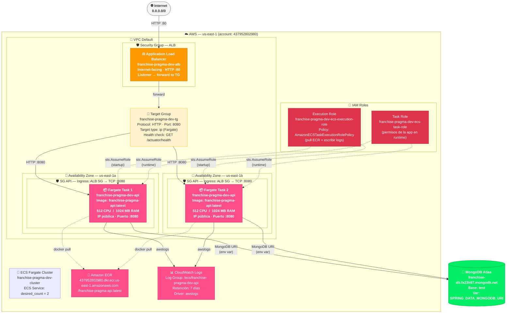

# Diagrama de Arquitectura AWS — Franchise Pragma API

> **Cómo visualizar en draw.io:**
> 1. Abre [draw.io](https://app.diagrams.net/) (o la app de escritorio).
> 2. Menú **Extras → Edit Diagram**.
> 3. Cambia el formato a **Mermaid** (pestaña en la parte superior del editor).
> 4. Pega el código Mermaid de abajo y haz clic en **OK**.

---

---

## Resumen de recursos desplegados

| Módulo | Recurso AWS | Nombre / Valor |
|--------|-------------|----------------|
| **networking** | VPC | Default VPC |
| **networking** | Subnets | 1 por AZ (us-east-1a, us-east-1b) |
| **networking** | Security Group ALB | Ingress TCP :80 from 0.0.0.0/0 |
| **networking** | Security Group API | Ingress TCP :8080 from SG ALB |
| **alb** | Application Load Balancer | `franchise-pragma-dev-alb` (internet-facing) |
| **alb** | Listener | HTTP :80 → forward |
| **alb** | Target Group | `franchise-pragma-dev-tg` — health check: `/actuator/health` |
| **ecs** | ECS Cluster | `franchise-pragma-dev-cluster` |
| **ecs** | Task Definition | Fargate · 512 CPU · 1024 MB · awsvpc |
| **ecs** | ECS Service | `franchise-pragma-dev-service` · desired_count=2 |
| **ecs** | CloudWatch Log Group | `/ecs/franchise-pragma-dev-api` · 7 días |
| **iam** | Execution Role | `franchise-pragma-dev-ecs-execution-role` |
| **iam** | Task Role | `franchise-pragma-dev-ecs-task-role` |
| **externo** | ECR | `437952802980.dkr.ecr.us-east-1.amazonaws.com/franchise-pragma-api:latest` |
| **externo** | MongoDB Atlas | `franchise-db.fx23h97.mongodb.net` |

